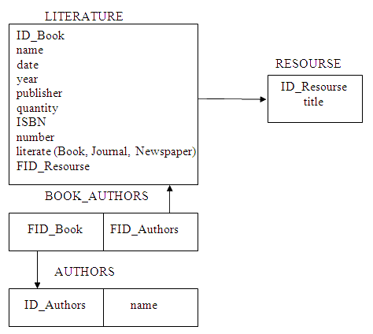
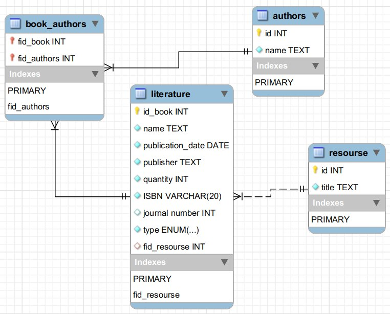
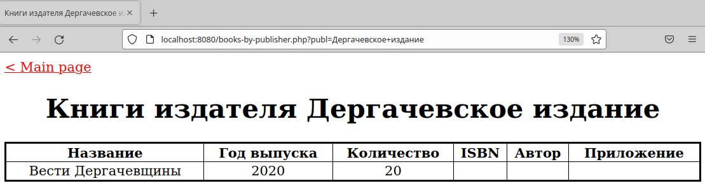
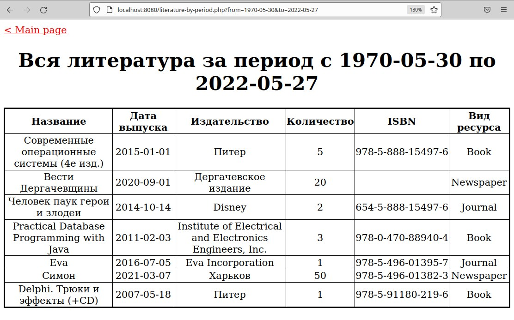
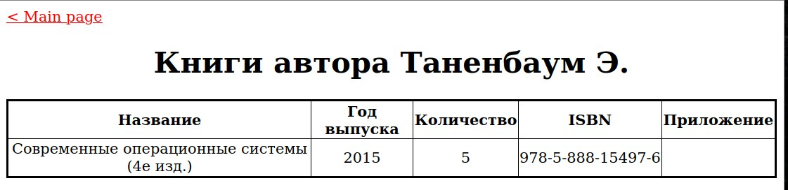

# Лабораторная работа №5. Изучение расширения PDO для обеспечения абстракции доступак базам данных

### Автор: Мякшин А.С. КИУКИ-19-5 
### Задание:

Создать и заполнить произвольными данными БД для хранения информации 
об информационных ресурсах библиотеки. 

Различают 3 вида ресурсов: книги, журналы, газеты. 
Книги характеризуются названием, уникальным номером 
(ISBN), издательством, годом издания, количеством страниц. 
У книги может быть произвольное количество авторов. 
Журналы характеризуются названием, годом выпуска, номером. 
Газеты характеризуются названием и датой выхода (день, месяц, год). 
Книги и журналы могут содержать дополнительные информационные ресурсы 
(например, компакт-диски), которые учитываются и регистрируются отдельно.

Сформировать запросы, которые будут выводить на экран информацию о:
1. Книгах указанного издательства;
2. Книгах, журналах и газетах, опубликованных за указанный временной период (учитывать год издания);
3. Книгах указанного автора.

Примеры скриншотов [стартовой страницы](docs/itech2_lab_pdo_literature_index.png) 
и [страницы результата](docs/itech2_lab_pdo_literature_result.png).
Обратите внимание, что здесь все три запроса объединены в одной форме, 
и результат формируется в зависимости от того, какие именно поля были заполнены.
Для будущей работы было бы удобнее разделить на три отдельные формы, 
и каждой из них сделать свой обработчик, формирующий свою страницу 
с результатом одного запроса.

---

## Результаты:

##### База Данных:
 

##### Главная страница:
 

##### Результат запроса (Книги издательства):
 

#####  Результат запроса (Литература за период):
 

##### Результат запроса (Книги автора):
 